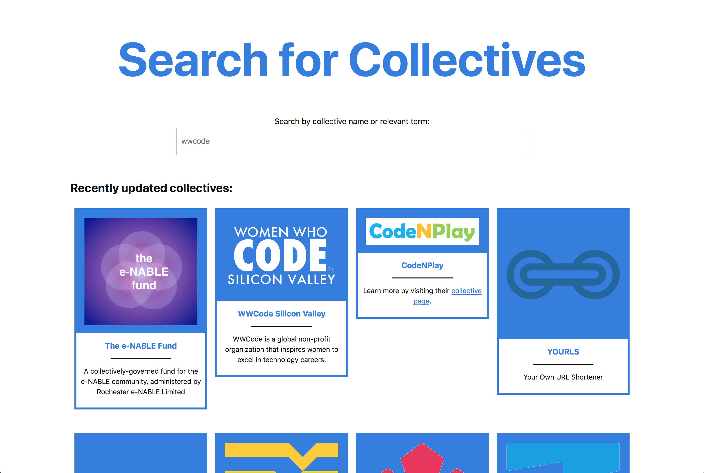

# Collective Search

A standalone application for searching Open Collective for collectives.

## Setup Steps
Starting in your terminal of choice:

- run `git clone https://github.com/HipsterBrown/collective-search.git && cd collective-search`
- run `npm install` to install dependencies && devDependencies
- create a `.env` file by running `cp .env.example .env`
- configure PG variables in the `.env` file to match your local Postgres credentials (see "Postgres Setup" instructions for more details)
- run `npm run db:setup` for database setup and seeding
  - runs `sequelize db:create` to create development database
  - runs `sequelize db:migrate` to run all pending migrations
  - runs `sequelize db:seed:all` to seed initial collective data from data/collectives.csv

## Start Application

`npm start` will start the application server using [`nodemon`](https://www.npmjs.com/package/nodemon) and listen on the port configured to the `PORT` environment variable or default to 8080.



## Postgres Setup

The easiest, and probably quickest, way to set up PostgresSQL on a Mac is [Postgres.app](https://postgresapp.com/). Once that is downloaded and started, the `.env` file created during the "Setup Steps" section should be update with your computer username set as `PGUSER`. If you want to confirm your username, run `echo $USER`

`.env`
```
PGUSER=yourUsername
PGPASSWORD=null
PGHOST=localhost
```

For other installations of PostgresSQL, see the project's "Downloads" page (https://www.postgresql.org/download/) and the `.env` setup should be the same.

## Design Decisions

This application was primarily built with [Express](http://expressjs.com/), [Sequelize](http://docs.sequelizejs.com/), [Tachyons](http://tachyons.io/), [PostgresSQL](https://www.postgresql.org/), and [Handlebars](http://handlebarsjs.com/).

Express is used for ease of setup and flexible API to configure various view engines, routes, and middleware. The `express-handlebars` module is used to render Handlebars templates, with nice default configuration for using layout templates and partials. 

PostgresSQL is key to this application's functionality as the `pg-search-sequelize` module is used to take advantage of the [full-text search](https://www.postgresql.org/docs/9.6/static/textsearch.html) included with the database. The original approach for the application was an "ILIKE" query to match a Collective names. The full text search approach creates a[materialized view](https://www.postgresql.org/docs/9.6/static/sql-creatematerializedview.html) containing Collective names, descriptions (short and long), mission statements, and tags to allow a more general and scalable search experience.

Sequelize provides a pleasant set of conventions for managing models, migrations, and seed files for the data stored in PostgresSQL.

Tachyons is a flexible set of CSS utility classes, which is very useful for prototypes and production application as the total minified source code is just under 80 kilobytes. The ability to quickly style and arrange elements in a template without switching context to a custom CSS file makes development a breeze. 
